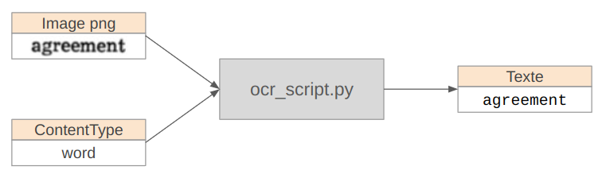
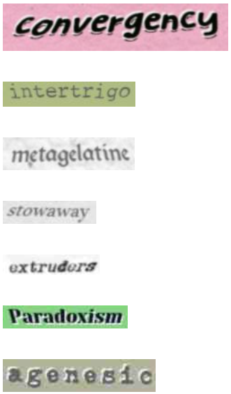

# Optical Character Recognition

## Consignes

Le rendu devra comporter :

**1. Une documentation du projet traitant les points suivants :**

- Les objectifs du projet
- Les données utilisées (origine, format, statut juridique) et les traitements opérés sur celles-ci
- La méthodologie (comment vous vous êtes répartis le travail, comment vous avez identifié les problèmes et les avez résolus, différentes étapes du projet…)
- L’implémentation ou les implémentations (modélisation le cas échéant, modules et/ou API utilisés, différents langages le cas échéant)
- Les résultats (fichiers output, visualisations…) et une discussion sur ces résultats (ce que vous auriez aimé faire et ce que vous avez pu faire par exemple)

On attend de la documentation technique, pas une dissertation. Elle pourra prendre le format d’un ou plusieurs fichiers, d’un site web, d’un notebook de démonstration, à votre convenance

**La documentation ne doit pas, jamais, sous aucun prétexte, comporter de capture d’écran de code.**

**2. Le code Python et les codes annexes (JS par ex.) que vous avez produit. Le code doit être commenté. Des tests, ce serait bien. Évitez les notebooks, préférez les interfaces en ligne de commande ou web (ou graphiques si vous êtes très motivé⋅es)**

**3. Les éventuelles données en input et en output (ou un échantillon si le volume est important)**

Votre travail sera de réaliser une interface web en Python pour un système de TAL, de traitement ou d’accès à des données. Elle devra au moins comprendre une interface programmatique sous la forme d’une API REST utilisable par un serveur ASGI (c’est par exemple le cas de celles réalisée en FastAPI que vous avez vues en cours) et une interface utilisateur qui pourra prendre la forme d’un script ou très, très préférablement d’une interface web HTML + CSS + js


## Système

#### Objectif

Ecrire un script capable de reconnaître les caractères d'une image/document grâce à un modèle neuronal pré-entraîné. (`ocr_script.py`)

**Input :**

- image (fichier jpg ou png)
- type de document (mot unique, ligne unique, plusieurs lignes)

**Output :**

- texte correspondant au contenu de l'image



Commande :

```sh
python3 ocr_script.py chemin/vers/image docType
```

Des images d'exemple sont mise à votre disposition. Vous pouvez ainsi tester le script avec ces images.

Exemple pour un mot :

```sh
python3 ocr_script.py ../data/images/word3.png word
```

Exemple pour une ligne :

```sh
python3 ocr_script.py ../data/images/line2.png line
```

Exemple pour un paragraphe :

```sh
python3 ocr_script.py ../data/images/doc1.png doc
```

#### Scripts

- `train_ocr_model.ipynb` : notebook ayant permis l'entraînement du modèle
- `segmentation.py` : script permettant de prétraiter les données pour les transformer en images de caractères. Ce script est appelé par le script principal `ocr_script.py`.
- `ocr_script.py` : script principal, qui effectue la reconnaissance de caractères d'une image donnée.


#### A faire :

- Faire un fichier de requirements


#### Méthodologie

Afin de parvenir à notre objectif, à savoir obtenir un script capable de reconnaître les caractères d'une image grâce à un modèle neuronal pré-entraîné, nous avons procédé avec la méthodologie suivante.

**1. Données**

Nous avons commencé par trouver un jeu de données permettant d'entraîner un modèle d'OCR. Nous avons utilisé le dataset `DonkeySmall/OCR-English-Printed-12` trouvé sur HuggingFace, contenant 1.000.000 images de mots avec leur transcription en chaîne de caractères.
Voici des exemples d'images du dataset :



**2. Prétraitement**

Une fois nos données récupérées, il nous a fallu les prétraiter. En effet, nous voulion un modèle capable de reconnaître des images de caractères. Or, le jeu de données étant constitué de mots et non de caractères uniques, nous avons du trouver un moyen de segmenter les images de mots en images de caractères. Pour cela, nous avons utilisé le module `PyTesseract`, qui est un outil de reconnaissance de caractères. Nous avons uniquement utilisé sa méthode `image_to_boxes`, qui segmente une image de texte en images de caractères. Nous avons appliqué cette méthode aux mots de notre dataset et avons conservé uniquement les cas où le nombre de caractères trouvés par segmentation correspondait au nombre de caractères du mot, afin de supprimer les cas où des caractères seraient restés "collés" ou au contraire où un caractère aurait été "coupé en deux".
Nous avons ainsi obtenu une liste de tuples où le premier élément de chaque tuple correspond à la liste des images de caractères du mot et le second aux caractères correspondants. Nous avons alors pu séparer notre dataset en un ensemble d'entraînement (80%) et un ensemble de test (20%).

**3. Modèle**

Nous avons ensuite commencé à construire notre modèle. Nous avons testé différentes architectures de modèle, mais celle qui semblait donner les meilleurs résultats est la suivante.

La première couche extrait des caractéristiques locales des images de caractères en appliquant des filtres de 3x3 pixels à l'image d'input (28x28 pixels). On utilise ensuite une fonction d'activation ReLU. La couche suivante, MaxPooling2D, réduit de moitié la map de features en prenant la valeur maximale de chaque patch de features pour conserver les caractéristiques les plus importantes. Cela permet de rendre le réseau plus efficace computationnellement et de réduire le sur-apprentissage. On utilise ensuite une seconde couche de convolution qui prend en entrée la sortie de la première couche et on effectue un second MaxPooling. On applique ensuite une couche Flatten aux sorties 2D des couches de convolution et de pooling pour les transformer en un vecteur à 1 dimension. Cela nous permet de pouvoir connecter nos couches précédentes à une couche dense entièrement connectée qui a pour rôle d'apprendre des relations entre les caractéristiques extraites par les différentes couches. On applique ensuite une couche de Dropout, qui désactive aléatoirement 50% des neurones, afin encore une fois d'éviter le sur-apprentissage. On utilise enfin une seconde couche dense avec une fonction d'activation softmax, qui correspond à notre couche de sortie.

Nous avons utilisé un optimiseur Adam et une categorical_crossentropy pour la loss car il s'agit d'un problème de classification multi-classes.

Pour l'entraînement du modèle, nous avons testé différents paramètres mais ceux qui semblaient donner les meilleures performances est un entraînement avec 20 époques et un batch_size. Cela signifie que le modèle parcourt 20 fois l'ensemble des données d'entraînement, et qu'il met à jour ses poids tous les 32 exemples.

Pour réaliser ce modèle, assez complexe, nous nous sommes beaucoup inspirées des ressources suivantes :
- Simple Convolutional Neural Network (CNN) for Dummies in PyTorch: A step-by-step guide. Medium. https://medium.com/@myringoleMLGOD/simple-convolutional-neural-network-cnn-for-dummies-in-pytorch-a-step-by-step-guide-6f4109f6df80
- Cours de CNN de Cédric Gendrot
- Hariyeh. CNN model implementing OCR. Kaggle. https://www.kaggle.com/code/harieh/cnn-model-implementing-ocr
- DataCorner. Image processing - Partie 7. DataCorner. https://datacorner.fr/image-processing-7/

**4. Vote des modèles**

Notre jeu de données contient, on le rappelle, 1.000.000 images de mots avec leur transcription. Ce chiffre étant d'autant plus grand que pour chaque mot, nous effectuons un prétraitement constistant en la segmentation de ses caractères, nous avons rapidement été confrontées à des contraintes matérielles. En effet, au-delà de 50000 mots, nos PC étaient dépassés. Cherchant une solution pour entraîner nostre modèle sur une plus grande partie des données, nous sommes finalement parvenues à une solution pour contourner le problème. Au lieu d'essayer d'entraîner le modèle sur plus de données, nous avons fait le choix d'entraîner le même modèle mais sur 5 sous-ensembles distincts du jeu de données. Ainsi, le premier modèle est entraîné sur les 50000 premiers mots, le deuxième sur les 50000 à 10000 mots suivants, etc. Nous avons ainsi obtenu 5 modèles identiques dans leur architecture et dans leurs paramètres, mais ayant été entraîné sur des données différentes. Nous avons ensuite défini une fonction de vote des modèles. Cela signifie que lorsque l'utilisateur donne une image de texte en entrée, chaque modèle va effectuer une prédiction du contenu textuel de l'image. Puis, notre fonction itère sur chaque caractère prédit par chaque modèle et compte simplement pour chacun lequel est le plus fréquent.

Prenons l'exemple du mot "agreement". Admettons que les modèles prédisent les textes suivants :

- model_1 : "aqreenent"
- model_2 : "agreeoent"
- model_3 : "agreement"
- model_4 : "agreemeot"
- model_5 : "aqreement"

Pour le premier caractère, pas de souci, les 5 modèles ont tous prédit un "a".

Pour le second caractère en revanche, deux des modèles ont prédit un "q" tandis que les trois autres ont prédit un "g". On va donc choisir un "g" pour la prédiction finale car c'est le caractère prédit pour la majorité des modèles, etc.

Cette astuce nous permet d'augmenter la fiabilité de la prédiction textuelle.

#### Résultats

- Les résultats (fichiers output, visualisations…) et une discussion sur ces résultats (ce que vous auriez aimé faire et ce que vous avez pu faire par exemple)


## Interfaces

#### Objectif

Proposer une interface programmatique et une interface web pour permettre à différents types d'utilisateurs d'utiliser notre système d'OCR.

#### Fait :

- Rien lol

#### A faire :

- Interface programmatique sous la forme d’une API REST utilisable par un serveur ASGI
- Interface utilisateur web (HTML + CSS + js)
